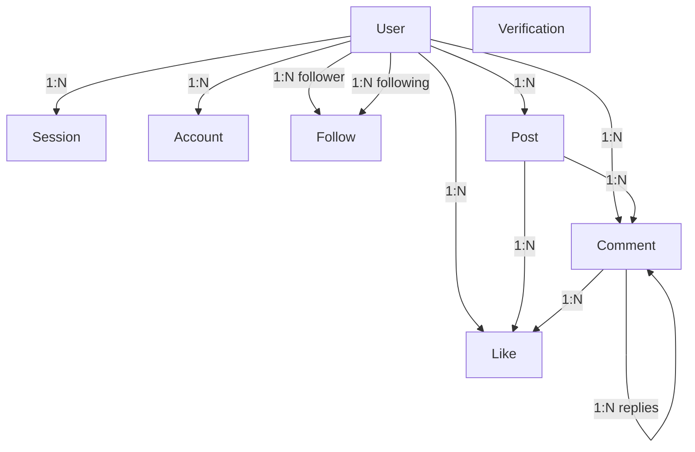

*This project has been created as part of the 42 curriculum by diwang, eandela, pekatsar, and nmattos-.*

# TRANSCENDENCE - 42OVERFLOW

- [Description](#description)
- [Instructions](#instructions)
- [Resources](#resources)
- [Team Info](#team-info)
- [Project Management](#project-management)
- [Technical Stack](#technical-stack)
- [Database Schema](#database-schema)
- [Features List](#features-list)
- [Modules](#modules)
- [Individual Contributions](#individual-contributions)
- [Known Limitations](#known-limitations)

## DESCRIPTION

Transcendence is the final project for the Codam Core curriculum, and must be completed with a team of 4-5 people. The goal is to simulate a professional software development team and environment, such that we build a product using a relevant tech stack as we would in the real world.

Our goal was to recreate a version of Stack Overflow for Codam students, 42overflow. Users can post questions related to the 42 curriculum, write and receive answers, comment, like posts, and upload images. The platform also features an AI Assist tool with two interchangeable LLM backends (Gemini free-tier API or a locally-running Gemma 3:4b via Ollama). A third option enables RAG mode, where a custom retrieval system fetches relevant community Q&A from the database and injects it as context, grounding the LLM's answers in 42/Codam-specific knowledge.

## INSTRUCTIONS

- Docker (v29.x) and Docker Compose (v5.x) are required.
- ~6 GB of available RAM (required if using the local Ollama/Gemma3:4b model)
- 3 `.env` files: at the project root, in llm-system-interface,  python-services/rag. All three have .env.example with the required variables.

### Running the project

```bash
docker compose up -d --build
```

The application will be available at `https://localhost:8443`. Caddy handles TLS (Transport Layer Security) termination automatically.

### RAG admin
On startup, we feed the RAG service with a static seed file of 42-curriculum Q&A pairs. To sync the RAG with live PostgreSQL data, use the /admin endpoints. See doc-dev-rag.md for more details.


## RESOURCES

### Frontend & Backend

| Resource | URL |
|----------|-----|
| SvelteKit documentation | https://svelte.dev/docs/kit |
| SvelteKit load functions | https://svelte.dev/docs/kit/load |
| better-auth | https://better-auth.com/ |
| better-auth PostgreSQL adapter | https://better-auth.com/docs/adapters/postgresql |
| Prisma | https://www.prisma.io/docs |

### Python — RAG Service

| Library | URL |
|---------|-----|
| FastAPI | https://fastapi.tiangolo.com/ |
| Uvicorn (ASGI server) | https://www.uvicorn.org/ |
| fastembed (local ONNX embeddings) | https://qdrant.github.io/fastembed/ |
| rank-bm25 (BM25Plus lexical search) | https://github.com/dorianbrown/rank_bm25 |
| NumPy (in-memory vector index) | https://numpy.org/ |
| asyncpg (async PostgreSQL) | https://magicstack.github.io/asyncpg/current/ |
| httpx (async HTTP client) | https://www.python-httpx.org/ |
| ChromaDB (originally used, replaced) | https://docs.trychroma.com/ |
| pytest-asyncio | https://pytest-asyncio.readthedocs.io/ |

### Python — Speech-to-Text Service

| Library | URL |
|---------|-----|
| faster-whisper | https://github.com/SYSTRAN/faster-whisper |
| OpenAI Whisper (original model) | https://openai.com/research/whisper |

### Go — LLM Interface Service

| Library | URL |
|---------|-----|
| gorilla/mux (HTTP router) | https://github.com/gorilla/mux |
| godotenv | https://github.com/joho/godotenv |
| golang.org/x/time/rate (rate limiter) | https://pkg.go.dev/golang.org/x/time/rate |
| Go net/http | https://pkg.go.dev/net/http |
| Go sync (RWMutex, etc.) | https://pkg.go.dev/sync |

### Infrastructure

| Tool | URL |
|------|-----|
| Docker | https://docs.docker.com/ |
| Docker Compose | https://docs.docker.com/compose/ |
| Ollama (local LLM server) | https://ollama.com/ |
| PostgreSQL | https://www.postgresql.org/docs/ |
| Caddy (reverse proxy) | https://caddyserver.com/docs/ |

### Theory & References

| Topic | URL |
|-------|-----|
| Cosine similarity | https://en.wikipedia.org/wiki/Cosine_similarity |
| Server-Sent Events (Go streaming) | https://developer.mozilla.org/en-US/docs/Web/API/Server-sent_events |
| Token bucket (rate limiting) | https://en.wikipedia.org/wiki/Token_bucket |
| BM25 ranking | https://en.wikipedia.org/wiki/Okapi_BM25 |
| RAG (Retrieval-Augmented Generation) | https://arxiv.org/abs/2005.11401 |

### AI Usage

AI tools were used for:
- Learning and tutorials
- Testing and debugging
- Generating seed data and fake/test PostgreSQL data for the RAG
- Documentation drafting

## TEAM INFO

| Name | Intra | Roles |
|------|------|-------------|
| Noah | (nmattos-) | PO + TL + Developer |
defined the product vision, prioritized features and oversaw technical decisions and architecture, made tech stack decisions
| Diane | (diwang) | PM + PO + Developer |
defined the product vision, prioritized features, tracked progress and deadlines, ensured team comms
| Petya | (pekatsar) | PM + PO + Developer |
organized team meetings, ensured team comms, managed risk and blockers, defined product vision, and prioritized features
| Elroy | (eandela) | TL + Developer |
ensured code quality and implement features and modules

## PROJECT MANAGEMENT

* Tools used for PM: Trello, Google Docs
* Communication channels: TEAMS, WhatsApp, IRL, Github
* How the team organized the work: task distribution via Trello and meetings; weekly meetings (30-60 minutes)

## TECHNICAL STACK

| Layer | Technology |
|-------|------------|
| Frontend + Backend | SvelteKit (TypeScript) |
| Database | PostgreSQL |
| ORM | Prisma |
| Authentication | better-auth (PostgreSQL adapter) |
| AI Gateway | Go (gorilla/mux, net/http, golang.org/x/time/rate) |
| RAG Service | Python 3, FastAPI, fastembed, rank-bm25, NumPy, asyncpg |
| Speech-to-Text | Python 3, FastAPI, faster-whisper |
| Local LLM | Ollama + Gemma 3:4b |
| Cloud LLM | Gemini free-tier API |
| Reverse Proxy | Caddy |
| Containerisation | Docker · Docker Compose |
| Validation | Zod |

**Justification for major technical choices:**

- **SvelteKit** was chosen as the unified full-stack framework. It keeps API routes and UI components co-located in one repository, removes the need for a separate backend service, and its file-based routing with SSR load functions made it natural for a small team to move fast without context-switching between separate codebases.
- **PostgreSQL** was chosen for its reliability, strong support in the Node.js ecosystem via Prisma, and native compatibility with better-auth's PostgreSQL adapter.
- **Prisma** was chosen as the ORM to provide a fully-typed database client generated from the schema. This prevents type errors across the team, makes migrations traceable in git, and lets all team members interact with the database safely.
- **Go** was chosen for the LLM gateway because of its lightweight goroutine model, which is well-suited for handling concurrent SSE streaming connections and rate limiting logic.
- **Python/FastAPI** was chosen for the RAG and speech-to-text services because the ML ecosystem (fastembed, rank-bm25, faster-whisper) is Python-native, and FastAPI provides async I/O out of the box.
- **Caddy** was chosen as the reverse proxy for its automatic HTTPS and simple configuration compared to Nginx.

## DATABASE SCHEMA


### Overview

The application uses a PostgreSQL database managed through Prisma ORM. The schema supports user authentication, social interactions, comment/post creation, commenting, and liking functionality.

### Database Structure

#### Authentication Tables

* **User** – Stores user profile information and account settings.
* **Session** – Manages active user sessions and authentication tokens.
* **Account** – Stores authentication information (better-auth).
* **Verification** – Handles verification.

#### Application Tables

* **Follow** – Represents follower/following relationships between users.
* **Post** – Stores user-created posts.
* **Comment** – Stores comments on posts or other comments (threads).
* **Like** – Stores likes for posts and comments.

### Relationships

* A **User** can have multiple **Sessions** and **Accounts**.
* A **User** can create multiple **Posts** and **Comments**.
* Users can follow other users through the **Follow** table.
* A **Post** belongs to one User and can have multiple Comments and Likes.
* A **Comment** belongs to one Post and one User.
* A **Comment** can have a parent comment, and multiple children (replies).
* A **Like** belongs to one User and can be associated with either a Post or a Comment.

### Key Fields and Data Types

| Table        | Key Fields                            | Data Types                      |
| ------------ | ------------------------------------- | ------------------------------- |
| User         | email, role, deleted_at               | String, Boolean, Enum, DateTime |
| Session      | userId, accessToken, expiresAt        | String, DateTime                |
| Account      | userId, password  	                   | String, DateTime                |
| Verification | identifier, expiresAt          	   | String, DateTime                |
| Follow       | followerId, followingId         	   | Int, String                     |
| Post         | title, content, userId          	   | Int, String, DateTime           |
| Comment      | content, postId, userId, parentId	   | Int, String, DateTime           |
| Like         | userId, postId, commentId         	   | Int, String                     |

The schema uses primary keys (`id`), foreign keys (`userId`, `postId`, `commentId`), unique constraints, and indexes to maintain data integrity and optimize performance.

## FEATURES LIST

| Feature | Team Member(s) | Description |
|---------|---------------|-------------|
| RAG (Retrieval-Augmented Generation) | Petya | Hybrid retrieval microservice (dense + BM25Plus) that fetches relevant community Q&A from the database and injects it as context for the LLM. Loaded from a seed file on startup; synced from PostgreSQL on demand. |
| LLM system interface | Petya | Go gateway supporting two LLM backends (Gemini API and local Gemma3:4b via Ollama) with SSE streaming, token-bucket rate limiting, and error handling. |
| Voice/speech integration | Petya | Browser microphone recording via `MediaRecorder`; audio sent to a faster-whisper Python service for local transcription; transcript inserted into the AI Assist input. |
| Posts | Diane | Users can create posts with a title and content. This is the main way users can post important information, ask questions, or share insights related to the 42 curriculum. |
| Editable profile with default avatar | Diane | Users can update their name, biography, and avatar image. A default avatar is shown when none is provided. |
| Comments | Noah | Users can comment on posts and reply to other comments. This creates threads within the comment section, allowing for organized discussions. Comments can be edited or deleted by the comment author, and support image uploads to enhance communication. |
| Likes for comments | Noah | Users can like comments, and the total number of likes is displayed on each comment. |
| Follow Users | Diane | Allows users to follow other users and see their online status. |
| Advanced Permissions | Elroy | Site-wide USER, MODERATOR, and ADMIN roles let trusted members moderate content, with ADMINs able to manage user accounts and roles from a dedicated overview page. |
| Organizations | Elroy | Users can create and join "Subjects", group spaces with their own MEMBER, CURATOR, and OWNER roles for organizing discussions and self-moderating content. |
| Custom Design Modules | Diane/Noah | Reusable components and variables for colors, typography, and shapes to create a consistent design across the application. |
| Real-time updates | Noah | Real-time updates for comments and likes using SSE (Server-Sent Events), allowing users to see when others are commenting or liking without needing to refresh the page. |
| Authentication | Diane | Standard user management and authentication using better-auth, allowing users to sign up and log in. |

## MODULES

#### MAJOR (2PT): Use a framework for both the frontend and backend - *(Noah)*
*A framework is an infrastructure for efficiently building of web applications.*\
**Justification**: SvelteKit is a modern framework that allows for both frontend and backend development in one framework. It is fast, efficient, and has a great developer experience. It also allows for server-side rendering, which is important for performance.\
**Implementation**: We used SvelteKit for both the frontend and backend. The frontend is built using Svelte components, and the backend is built using SvelteKit endpoints.

---

#### MAJOR (2PT): Allow users to interact with other users, chat - *(Noah)*
**Justification**: This is a user friendly web application geared towards a user that would return to the site for information/content, etc. When asking a question, it is important to be able to interact with other users in real-time. This is why the comment system functions most like a chat system.\
**Implementation**: The comment system is real-time (SSE), allowing users to interact with each other without delay. This results in a more engaging and interactive experience for the user.

---

#### MINOR (1PT): Use an ORM for the database - *(Noah)*
*An ORM is a tool that allows developers to interact with a database using an object-oriented approach.*\
**Justification**: Prisma is a modern ORM that allows for easy database management and querying. It is type-safe, which means that it will catch errors at compile time. Noah has also worked with it previously.\
**Implementation**: We used Prisma for the database management and querying.

---

#### Minor (1 PT): Custom-made design system - *(Diane/Noah)*
*A template for the overall design and styling of the application.*\
**Justification**: Building a real-world web application for general users, requires a user friendly and interactive front-end website; this module makes that process faster and stream-lined. This was a fun and creative module, and experience with design and code I haven't previously implemented at Codam.\
**Implementation**: There is a style sheet for the colors, typography, and icons, and from there 10 standard components given our 42overflow project.

---

#### Major (2 PT): Standard user management and authentication - *(Diane)*
*Users can update their profile information. Users can upload an avatar (with a default avatar if none provided). Users can add other users as friends and see their online status. Users have a profile page displaying their information.*\
**Justification**: This is a user friendly web application geared towards a user that would return to the site for information/content, etc. The behavior implies a log-in, profile, and additional information. This is a relevant part of our web app.\
**Implementation**: This tied in nicely with the custom-made design system, and each page was built separately (SvelteKit makes this simple with a route to the page and then consistent ways to code the FE and BE functionality for each page), e.g. log-in, sign-up, profile page, settings for logging out, and editing of the profile, etc. In addition, there was design/UX/UI elements to be considered for the user in addition to the coding.

---

#### MAJOR (2PT): Advanced permissions system - *(Elroy)*
*The app has three site wide roles: USER, MODERATOR, and ADMIN. ADMINs can view, edit, and delete users and change user roles and moderate content by deleting posts and comments. MODERATORs can only view users and moderate content by deleting posts and comments.*\
**justification**: An open platform like ours has a risk of users posting low quality or harmful content. The roles ensure that trusted community members (MODERATORs) and staff (ADMINs) can remove inappropriate content.\
**implementation**: The permission system is implemented in the database with a Role enum (USER, MODERATOR, ADMIN). In our app MODERATORs and ADMINs will see the ability to delete posts and comments in the same way the author would. ADMINs and MODERATORs have the ability to navigate to the /users/ page where they see an overview of all users. ADMINs can edit various fields of the USERs and both ADMINs and MODERATORs can see USERs posts and comments and delete them.

---

#### MAJOR (2PT): An organzation system - *(Elroy)*
*Users can create, edit, and delete organizations (called "Subjects" in the codebase) that act as group spaces. Each subject has MEMBER, CURATOR, and OWNER roles. Owners can edit the subject, manage members, archive it and moderate content. CURATORs can view members and moderate content. Any logged in user can discover, join, or create subjects and interact with posts within them.*\
**justification**: Subjects allow students to organize around specific projects. Keeping discussions relevant. The different roles ensure that each subject is self moderating.\
**implementation**: The system uses a Prisma Subject model with a SubjectMember table and a SubjectRole enum (MEMBER, CURATOR, OWNER).

---

#### MAJOR (2PT): Implement a complete RAG - *(Petya)*
**Justification:** LLMs have limited knowledge — they do not know 42-specific norms, common project bugs, or community conventions. Feeding them with real community data via a RAG system lets the AI give accurate, contextually relevant answers based on community knowledge.\
**Implementation:** The RAG is a standalone Python/FastAPI microservice (`python-services/rag/`). It uses a hybrid retrieval approach:

- **Dense retrieval:** [fastembed](https://qdrant.github.io/fastembed/) generates local ONNX embeddings (no external API calls). An in-memory NumPy matrix stores all document vectors. Query-time cosine similarity produces a ranked list of semantically similar chunks.
- **Sparse retrieval:** BM25Plus (via `rank-bm25`) provides keyword-based lexical matching, catching exact terminology that dense search may miss.
- Both scores are fused and the top-k chunks are returned to the LLM service as context.

**Data loading flow:**
1. On startup, the RAG loads a hand-crafted seed file of 42-curriculum Q&A pairs.
2. At any time an admin can call `/admin/sync-db` (or run `./reload_rag.sh`) to pull live Q&A data from PostgreSQL via `asyncpg`.
3. Fake/test data can be included or excluded via a query flag, so development fixtures do not pollute production context.
4. `/admin/clear-cache` and `/admin/reset` allow wiping embeddings and reloading from scratch.

ChromaDB was initially used for retrieval but proved too slow on CPU at query time. A NumPy in-memory index was added to handle fast retrieval instead. ChromaDB is still running in the stack — it serves as a persistent embedding store: on every sync, only new or changed documents are re-embedded (detected by content hash), and the rest are fetched from ChromaDB to rebuild the NumPy index in memory. This avoids re-embedding the entire corpus on every restart. ChromaDB is also kept for learning purposes.

---

#### MAJOR (2PT): Implement a complete LLM system interface - *(Petya)*
**Justification:** Students can ask questions to the LLM and get answers. Error handling, rate limiting, and streaming are implemented to deliver a responsive, production-quality AI Assist experience.\
**Implementation:** A Go service (`llm-system-interface/`) acts as the gateway between the SvelteKit frontend and the LLM backends:

- **Streaming responses** via Server-Sent Events (SSE) — answers appear word-by-word rather than after a long wait.
- **Rate limiting** via a token-bucket algorithm (`golang.org/x/time/rate`) to prevent abuse.
- **Two interchangeable backends:**
  - **Gemini free-tier API** — good quality, zero hardware cost, but rate-limited.
  - **Gemma 3:4b via Ollama** — a locally-running open-weight model; completely free, unlimited usage, runs on CPU/RAM within the Docker Compose stack. Pros: free, good quality, CPU/RAM can handle it, unlimited usage. Cons: not as good as paid models, training data ends in 2023.
- `sync.RWMutex`-protected state for safe concurrent handling of multiple streaming requests.
- When RAG mode is enabled, the Go service fetches the top context chunks from the Python RAG service before each LLM call and injects them into the system prompt.

---

#### MINOR (1PT): Voice/speech integration for accessibility or interaction - *(Petya)*
**Justification:** Voice input makes the platform more accessible to students with motor impairments or those who prefer speaking, and demonstrates a real-world multimodal integration pattern.\
**Implementation:** Speech-to-text is implemented using the faster-whisper library. The client uses the browser's `MediaRecorder` API to record voice input, which is sent as a blob to the backend. faster-whisper converts the blob to text locally (no third-party transcription API required). The resulting text is returned to the frontend and inserted into the AI Assist input field, from where the normal LLM flow continues.

---

 **TOTAL: 17 POINTS**

## INDIVIDUAL CONTRIBUTIONS

### Elroy
 I built the site's user directory and the role-based moderation. My two major modules were Advanced Permissions and Organizations. For Advanced Permissions, I added the Role enum (USER, MODERATOR, ADMIN) to the database and built the /users overview page with role-based visibility (admins can view/edit user details and see emails; moderators can view users and moderate content), plus the backend utilities for changing roles, soft-deleting accounts, and deleting posts/comments. For Organizations, I designed and built the "Subjects" system. the Subject/SubjectMember Prisma models with a SubjectRole enum (MEMBER, CURATOR, OWNER), the API routes for creating, editing, archiving, and subscribing/unsubscribing to subjects, the /subjects list and creation flow, the /s/[slug] subject pages with their own posts, and the manage page owners use to edit, archive, and moderate their subject (with safeguards like blocking the last owner from unsubscribing). I also wrote the database seed script that spins up an admin, moderator, and regular user with sample subjects and posts for local testing and added robots.txt to keep private/admin pages out of search engines. I documented the reasoning behind both modules in the Modules section above.
### Petya
 - Designed and implemented the hybrid RAG microservice (Python/FastAPI): fastembed dense retrieval, BM25Plus lexical search, in-memory NumPy vector index, seed data loading, PostgreSQL sync endpoints, admin reset endpoints, and test suite (`pytest-asyncio`).
- Designed and implemented the Go LLM gateway: SSE streaming, token-bucket rate limiting, Gemini API integration, Ollama/Gemma3:4b local model integration, RAG context injection.
- Implemented the speech-to-text microservice: faster-whisper transcription, browser MediaRecorder integration.
- Authored `reload_rag.sh` helper script and RAG seed data.
- Set up Ollama Docker service and model initialisation scripts.

**Challenges:**
- *ChromaDB → in-memory replacement:* ChromaDB was initially used as the vector store but caused reliability issues inside Docker and introduced significant image size overhead. Replacing it with a pure NumPy in-memory index required re-implementing cosine similarity search from scratch but yielded a much leaner, faster-starting container.
- *Local LLM setup:* Running Ollama with Gemma3:4b inside Docker Compose on a development machine required careful resource tuning and a custom init script to pull the model binary on first run without blocking the rest of the stack.
- *Streaming + rate limiting in Go:* Coordinating SSE streaming with the rate limiter required careful use of `sync.RWMutex` and context cancellation to avoid goroutine leaks when clients disconnected mid-stream.

### Diane
 For the mandatory part, I completed the Privacy Policy and Terms of Service. I also completed the Custom Design Module and Standard user management and authentication. This includes a profile page that can be edited, an avatar photo that can be added, or a default provided, and the ability to add/remove friends, and see that person's status online. Also, the Home page, Log In, Sign In, Profile, Edit Profile, Settings, Post page. This includes most of the front-end, including small features. I created a google doc for the project as well to aid with the organization and contributed to the README.

### Noah
| Category        		| Description                           									|
| ----------------------| ------------------------------------------------------------------------- |
| Initial Setup			| Build project structure with SvelteKit									|
| Design Database		| Using PostgresQL and Prisma       										|
| Comment System		| Create, edit, delete, like, reply, image upload							|
| Threads				| Implement threaded comments with parent-child relationships				|
| Real-time Updates		| Implement SSE for real-time comment and like updates						|
| Frontend Components	| Build reusable Svelte components for comments, posts, and likes			|
| Design System			| Create a coherent design for a consistent and user-friendly interface		|
| README				| Contributed to the README.md file with technical details and formatting	|

## Known Limitations

- The local Gemma 3:4b model's training data ends in 2023; questions about very recent technologies may yield outdated answers.
- Ollama requires ~6 GB of RAM on the host machine; the Gemini API is the fallback for constrained environments.
- The in-memory vector index is rebuilt on RAG service restart; for large datasets a persistent vector store would be more appropriate.
- Speech-to-text accuracy depends on microphone quality and ambient noise.
